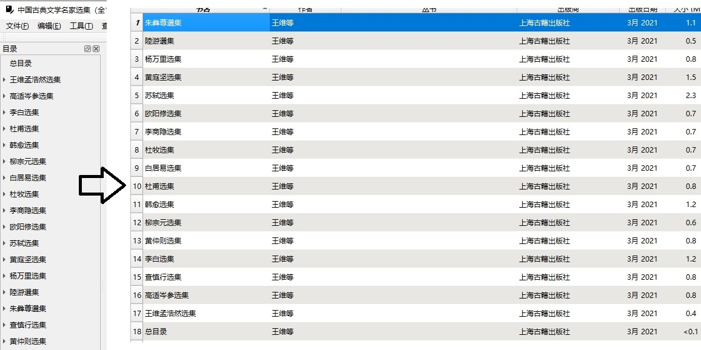

## EpubSplitter

基于目录 (toc.ncx) 分割 epub 文件

### 用法

```
usage: java -jar splitter.jar [-c] [-f <arg>] [-h] [-lv <arg>] [-o <arg>]
 -c,--contains1stLevelCatalog   the new catalog(toc.ncx) contain the first
                                level catalog, default: not contain.
 -f,--file <arg>                epub file path, required.
 -h,--help                      usage
 -lv,--catalogLevel <arg>       specify which level of catalog to split,
                                like: 1,2,3...etc, default: 1
 -o,--outputDir <arg>           specify the output directory, default:
                                current directory

```
